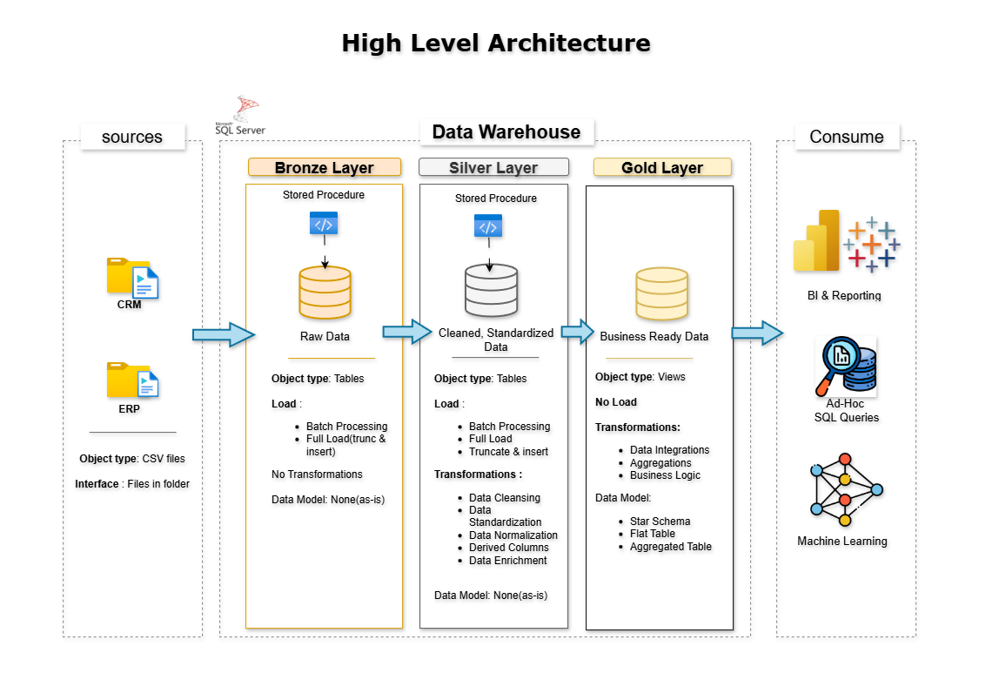
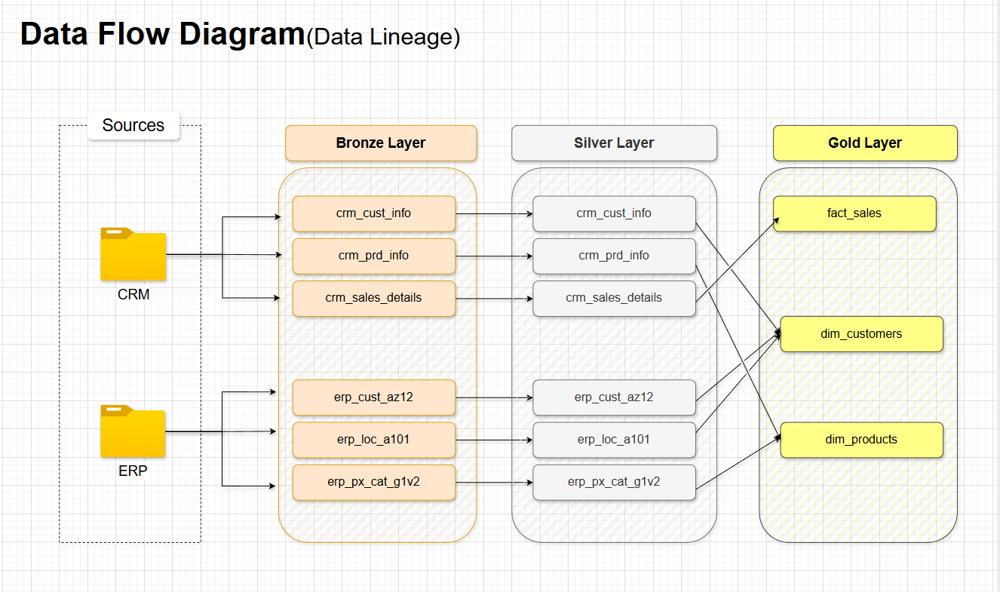
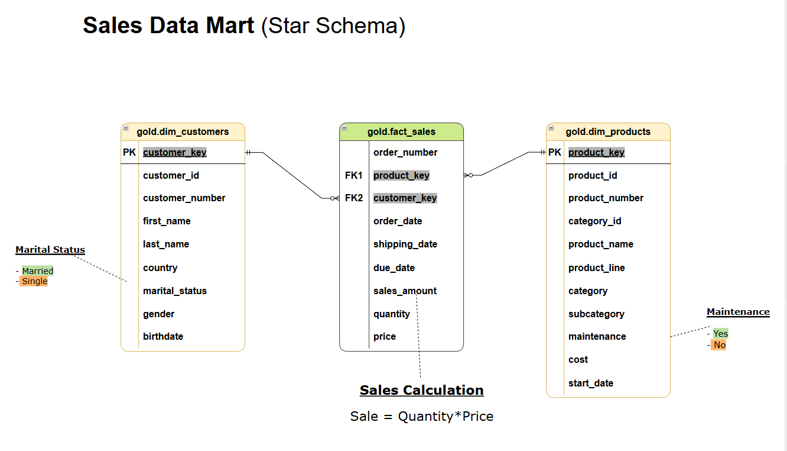

# Data Warehouse and Analytics Project

## Building a modern data warehouse with SQL Server, including ETL processes, data modeling, and analytics.


Welcome to the **Data Warehouse and Analytics Project** repository!
This project demonstrates a comprehensive data warehousing and analytics solution, from building a data warehouse to generating actionable insights. 

---
##  Data Architecture

The data architecture or pipeline for this project follows the Medallion Architecture with three progressive layers **Bronze**, **Silver**, and **Gold** layers:


1. **Bronze Layer**: Stores raw data as-is from the source systems. Data is ingested from CSV Files into SQL Server Database.
2. **Silver Layer**: This layer includes data cleansing, standardization, and normalization processes to prepare data for analysis.
3. **Gold Layer**: Houses business-ready data modeled into a star schema required for reporting and analytics.

---
## Project Overview
This project builds a modern data warehouse on SQL Server using the Medallion Architecture. It covers the full pipeline — from raw data ingestion through transformation and modeling, to SQL-based analytics and reporting.

What's included:
1. **Data Architecture**: Bronze, Silver, and Gold layers following Medallion design principles
2. **ETL Pipelines**: Extract, transform, and load workflows from ERP and CRM source systems
3. **Data Modeling**: Fact and dimension tables structured for efficient analytical queries
4. **Analytics & Reporting**: SQL reports surfacing insights on customers, products, and sales trends

---

## Tech Stack

| Area | Tools & Technologies |
|------|----------------------|
| Database | Microsoft SQL Server |
| Query Language | T-SQL |
| Architecture Pattern | Medallion (Bronze / Silver / Gold) |
| Data Modeling | Star Schema (Fact & Dimension tables) |
| Source Data | CSV flat files (ERP & CRM systems) |


---
## Project Requirements 

### Building the Data Warehouse (Data Engineering)

### Objective
Develop a modern data warehouse using SQL Server to consolidate sales data, enabling analytical reporting and informed decision-making.

### Specifications
- **Data Sources**: Import data from two source systems(ERP and CRM) provided as CVS files.
- **Data Quality**: Clean and resolve data quality issues before analysis.
- **Integration**: Combine both sources into a single, user-friendly data model designed for analytical queries.
- **Scope**: focus on the latest dataset only; historization of data is not required.
- **Documentation**: Provide clear documentation of the data model to support both business stakeholders and the analytics team.

---
## Data Flow — ETL Process




---
## Data Model

The Gold layer follows a **Star Schema** design:




---

### BI: Analytics & Reporting (Data Analytics)

### Objective
Develop SQL-based analytics to deliver detailed insights into:
- **Customer Behavior**
- **Product Performance**
- **Sales Trends**

These insights empower stakeholders with key business metrics, enabling strategic decision-making.

---
## Repository Structure
```
data-warehouse-project/
│
├── datasets/                           # Raw datasets used for the project (ERP and CRM data)
│
├── docs/                               # Project documentation and architecture details
│   ├── Data_Architecture.drawio        # Overall project architecture diagram
│   ├── data_architecture.png           # Architecture diagram export
│   ├── data_Integration Model.drawio   # Data integration model diagram
│   ├── data_integration.png            # Data integration diagram export
│   ├── data_layers.drawio              # Data layers diagram
│   ├── data_model.drawio               # Star schema and data model diagram
│   ├── data_model.png                  # Data model diagram export
│   ├── data_flow.png                   # Data flow diagram export
│   ├── ETL Methods.png                 # ETL techniques and methods visual
│   ├── data_catalog.md                 # Dataset catalog with field descriptions and metadata
│   └── naming_conventions.md           # Naming guidelines for tables, columns, and files
│
├── scripts/                            # SQL scripts for ETL and transformations
│   ├── bronze/                         # Scripts for extracting and loading raw data
│   ├── silver/                         # Scripts for cleaning and transforming data
│   └── gold/                           # Scripts for creating analytical models
│
├── tests/                              # Test scripts and data quality checks
│
├── README.md                           # Project overview and instructions
├── LICENSE                             # License information
└── .gitignore                          # Files and directories ignored by Git
```
## License
This project is licensed under the [MIT License](LICENSE). 


